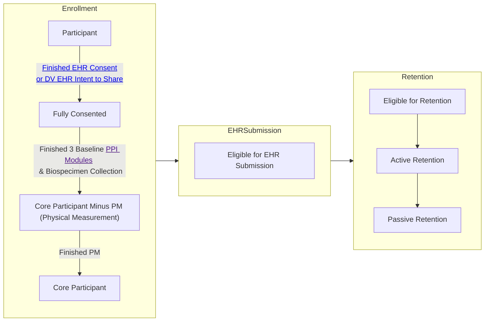

```mermaid
flowchart LR
    subgraph Enrollment
        A[Participant] --> |<u><a href='https://joinallofus.atlassian.net/wiki/spaces/DRC/pages/2883800/HealthPro+Release+Notes#HealthPro-Release-1.6.4%2D%2D%2Drelease-date-5%2F31%2F2019'>Finished EHR Consent \n or DV EHR Intent to Share</a></u>| B[Fully Consented]
        B[Fully Consented] --> |Finished 3 Baseline <u><a href=''>PPI Modules</a></u> \n & Biospecimen Collection| C["Core Participant Minus PM (Physical Measurement)"]
        C["Core Participant Minus PM (Physical Measurement)"] --> |Finished PM| D[Core Participant]
    end
    subgraph EHRSubmission
        H[Eligible for EHR Submission]
    end
    subgraph Retention
        E[Eligible for Retention] --> F[Active Retention]
        F[Active Retention] --> G[Passive Retention]
    end
    Enrollment --> EHRSubmission --> Retention

```
